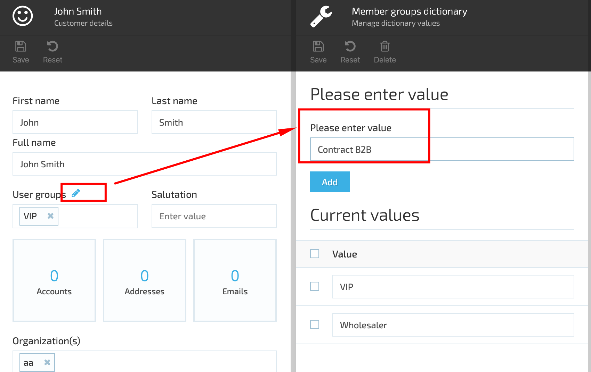

# Overview
The Catalog Personalization Module enables the personalization of catalogs through the use of User Groups.
This module allows catalog objects such as products and categories to be assigned to User Groups,
and different policies for User Group propagation in the catalog objects hierarchy can be defined.

The Catalog Personalization Module is designed to help businesses personalize their catalogs to specific User Groups.

This module enables catalog objects such as products and categories to be assigned to User Groups to control
their visibility. The module also offers different policies for User Group propagation in the catalog objects hierarchy,
such as UpTree and DownTree.

The Catalog Personalization Module provides a way to manage and assign User Groups to Catalog Objects.
User Groups can be created and assigned to Product Categories for filtration in the storefront search.

## Key Features
1. Personalize Catalog Visibility
1. Flexible User Group Propagation
1. Filter with User Groups
1. Efficient User Group Assignment

### Personalize Catalog Visibility
Control who sees what in your storefront with the Catalog Personalization Module.

### Flexible User Group Propagation
Choose the propagation policy that works best for your catalog hierarchy with the User Group Propagation Policies feature.

### Filter with User Groups
Improve storefront search results by assigning User Groups to Product Categories with the User Groups for Products or Categories Filtration feature.

### Efficient User Group Assignment
Save time and effort with the Assign User Groups feature, allowing you to easily create and assign User Groups to Catalog Objects.

## User Group Propagation
The module supports two policies for User Group propagation in the catalog objects hierarchy: UpTree and DownTree.

1. `UpTree` propagate the tags from descendants to parents up the hierarchy
;
1. `DownTree` inherits the tags by descendants from their parent down the hierarchy
.

## Scenarios

### Create New User Group

1. Go to More->Contacts module-> select a user from the list and open user's details;
1. Click the 'Edit' of the User Groups;

1. In the opened 'Member groups dictionary' enter the new User Group name and click the 'Add' button;
1. Save the new user group;

1. The new user group is now available for selection.

### Assign User Group to Contact

1. Go to More->Contacts module and select a Contact from the list;
1. Open Contact's details;
1. Select the User Group from the drop down;
1. Save the changes;
1. The selected User Group will be assigned to the Contact.

### Assign User Group to Product Category

1. Go to More->Catalog Module->select a Product Category and click 'Manage';
1. On Category details blade select the 'User Groups' widget;
1. Under 'Available User Groups' select the tag to assign to the Category;
1. Click 'Add';
1. Save the changes;
1. Open the Category;
1. Select a product and click the 'User Groups' widget;
1. The tag assigned to the Category will be displayed under the 'Inherited tag'. All Category products will inherit the tag assigned to the Category in case of DownTree propagation.

### Assign User Group to a Price List Assignment

1. Go to More->Pricing Module->select a Price list Assignment and open the Price list Assignments details;
1. Under 'Add condition' select 'Shopper profile' and then 'User Group contain';
1. Enter the User Group name into the corresponding field;
1. Save the changes.

### Assign User Group to Marketing Promotion

1. Go to More-Marketing module->Promotions;
1. Select a Promotion and open the promotion details blade;
1. Under 'Add user group' select 'User group contains';
1. Enter the user group name into the corresponding field;
1. Save the changes;
1. The assigned user group will be applied to the selected promotion.

### User Groups Propagation Policies

When down-tree propagation policy is selected, all products inherit the Tag propagated to the parent categories.

When the up-tree policy propagation is applied, the Product category will inherit the Product tag, i.e. if a tag is assigned to a specific product in the Category, it will be propagated to the Product Category as well.

In order to apply one of the policies you should go through the following steps:

1. Go to Settings->Personalization->General;
1. Under 'Selected policy for User Groups propagation' select either 'DownTree' or 'UpTree';
1. Restart the VC platform;
1. The selected policy will be applied.

#### Synchronize Outlines

The 'Synchronize outlines' function works for UpTree policy propagation and helps propagate user groups automatically from product to all product parents. The synchronization is based on the scheduled job.

