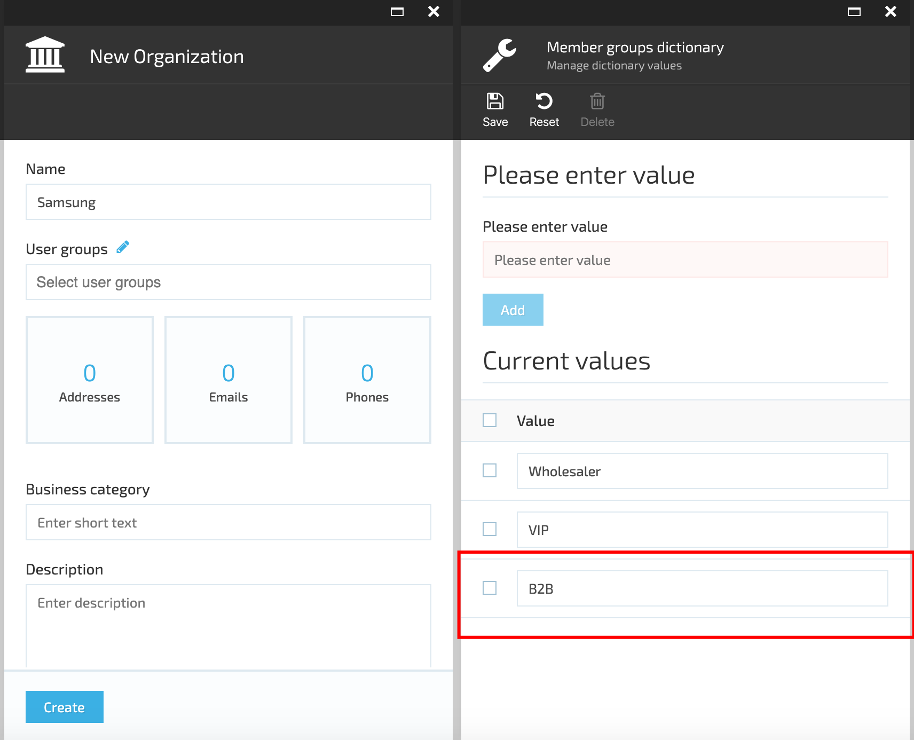
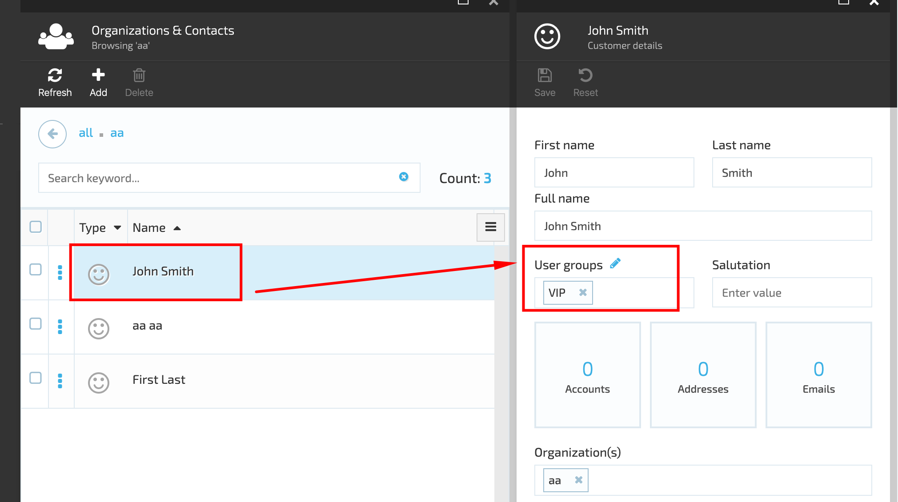
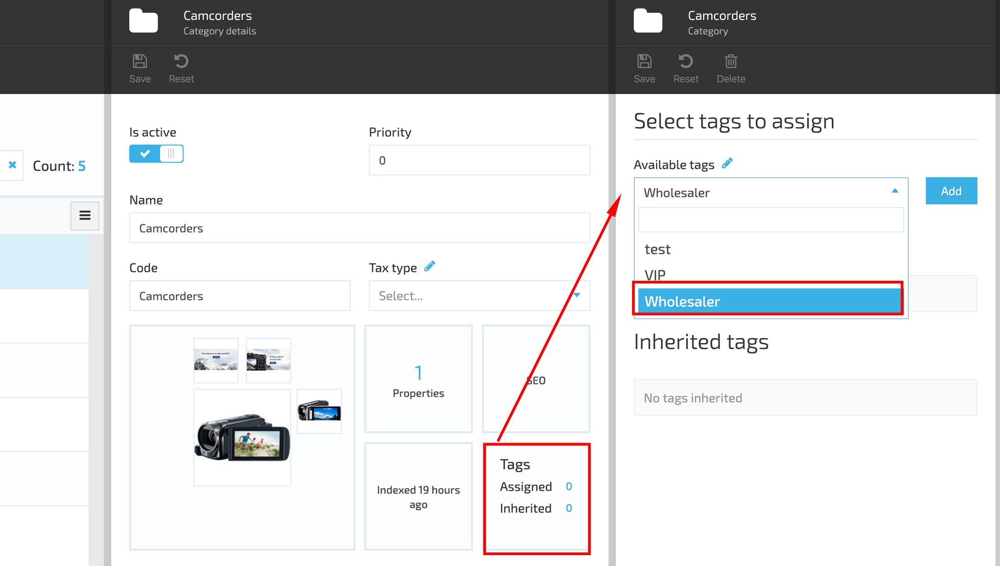
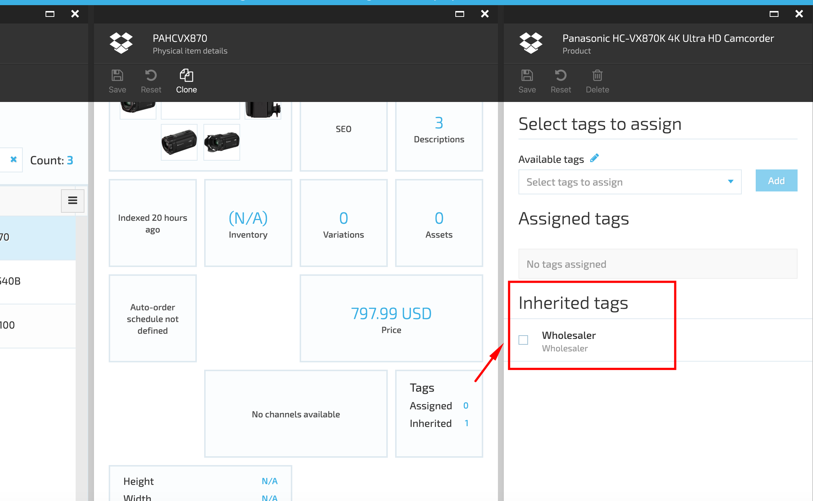
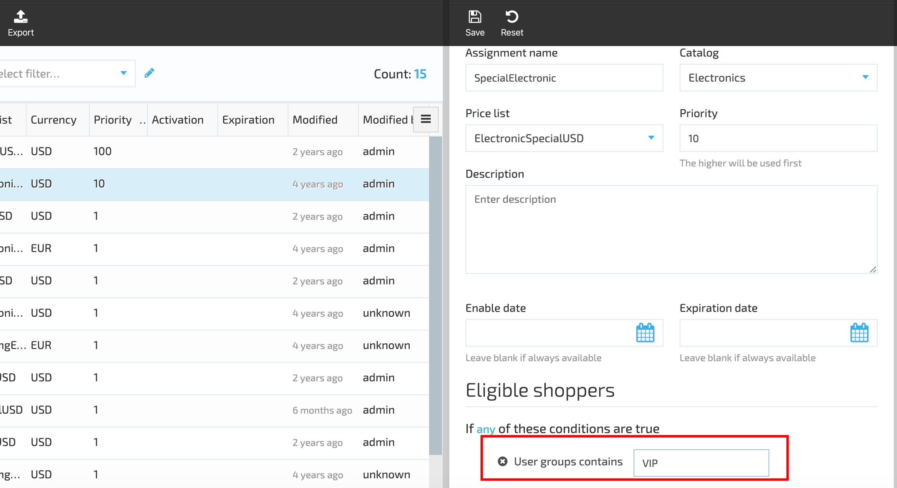
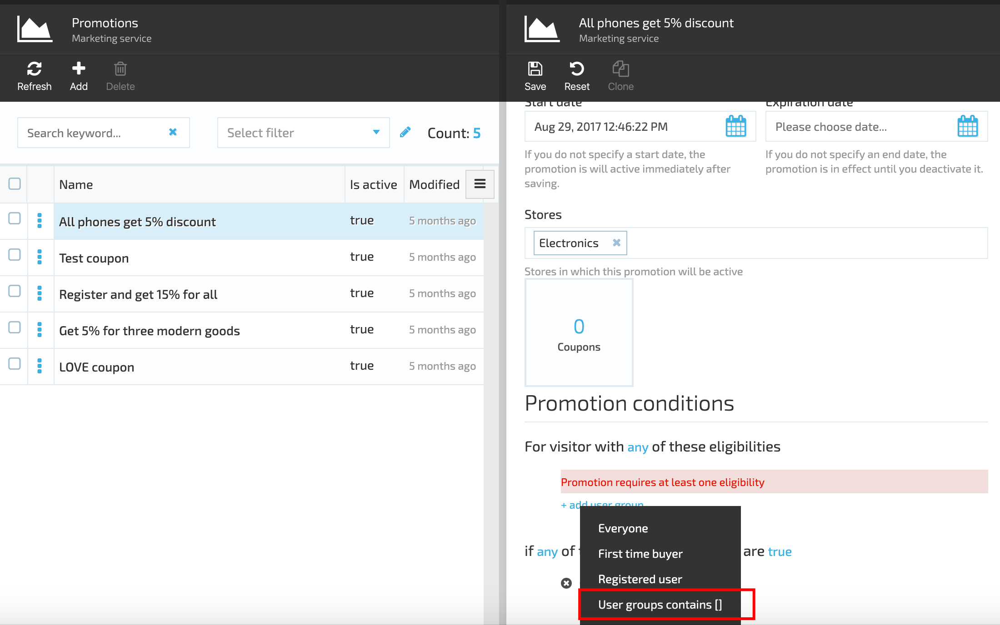
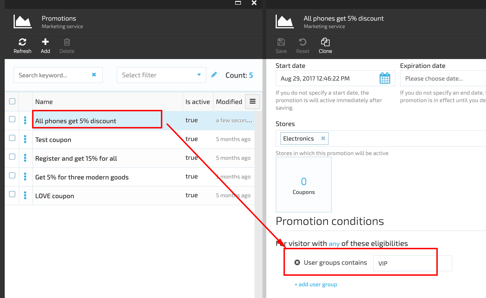
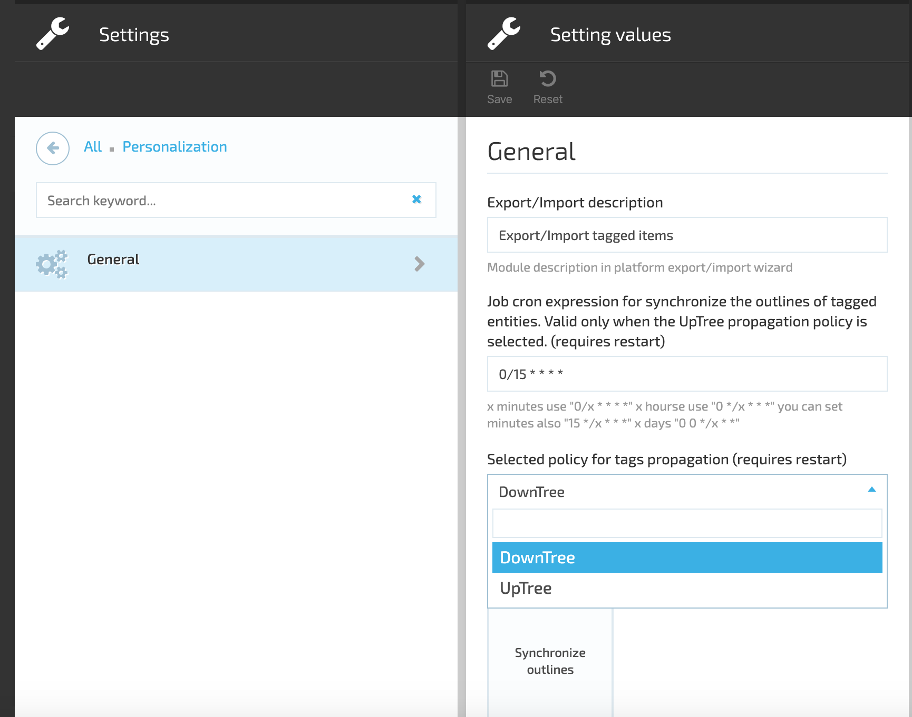
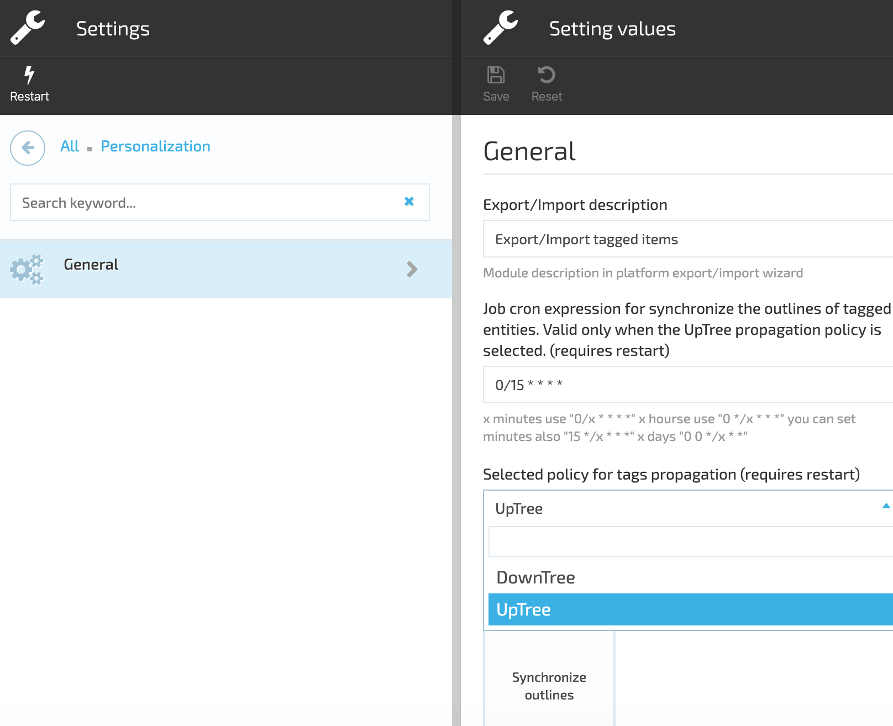
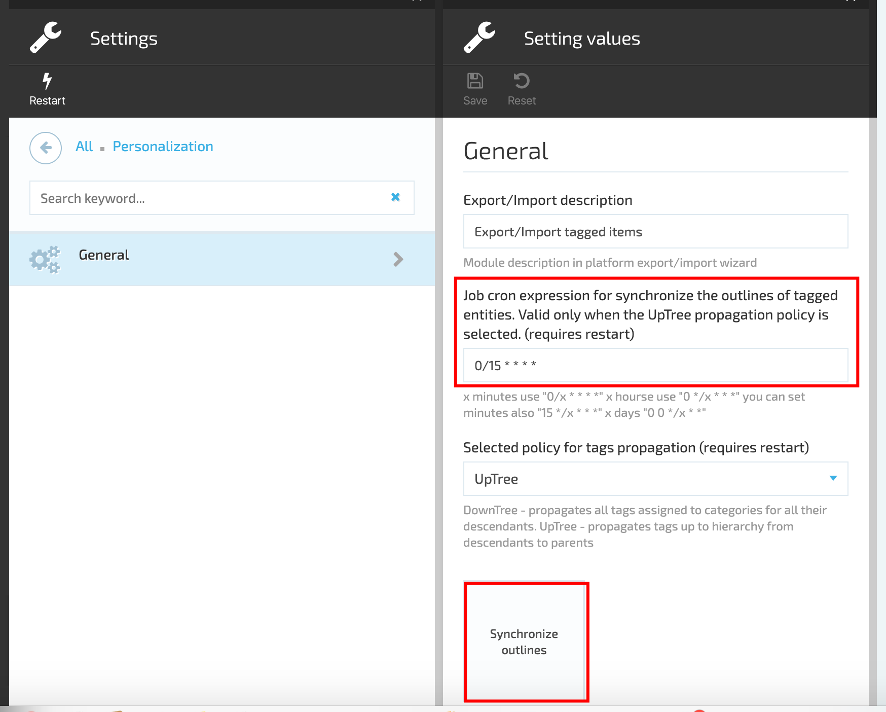

# Overview

The main concept of VC Personalization module is to personalize the issuing of catalog, price lists and marketing actions using Tags and User Groups.

The Contacts should be first included into a specific User Groups and then the catalogs, price lists or promotions should be assigned to this UG.

## Key features

1. Control the visibility of catalog objects such as Product and Categories, through manual tagging of these objects with special property `Tags` which can contain multiple predefined values which also may be defined for customer profile
1. Inheritance `Tags` between catalogs objects depend on catalog taxonomy;
1. Allow using `User groups` from customer profile to products or categories filtration in the storefront search
1. Different policies for `Tags` propagation in catalog objects hierarchy:
    1. `UpTree` propagate the tags from descendants to parents up the hierarchy
    ;
    1. `DownTree` inherits the tags by descendants from their parent down the hierarchy
    .

## Scenarios

### Create New User Group

1. Go to More->Contacts module-> select a user from the list and open user's details;
1. Click the 'Edit' of the User Groups;

1. In the opened 'Member groups dictionary' enter the new User Group name and click the 'Add' button;
1. Save the new user group;

1. The new user group is now available for selection.

### Assign User Group to Contact

1. Go to More->Contacts module and select a Contact from the list;
1. Open Contact's details;
1. Select the User Group from the drop down;
1. Save the changes;
1. The selected User Group will be assigned to the Contact.

### Assign User Group to Product Category

1. Go to More->Catalog Module->select a Product Category and click 'Manage';
1. On Category details blade select the 'Tags' widget;
1. Under 'Available tags' select the tag to assign to the Category;
1. Click 'Add';
1. Save the changes;
1. Open the Category;
1. Select a product and click the 'Tags' widget;
1. The tag assigned to the Category will be displayed under the 'Inherited tag'. All Category products will inherit the tag assigned to the Category in case of DownTree propagation.

### Assign User Group to a Price List Assignment

1. Go to More->Pricing Module->select a Price list Assignment and open the Price list Assignments details;
1. Under 'Add condition' select 'Shopper profile' and then 'User Group contain';
1. Enter the User Group name into the corresponding field;
1. Save the changes.

### Assign User Group to Marketing Promotion

1. Go to More-Marketing module->Promotions;
1. Select a Promotion and open the promotion details blade;
1. Under 'Add user group' select 'User group contains';
1. Enter the user group name into the corresponding field;
1. Save the changes;
1. The assigned user group will be applied to the selected promotion.

**Important!** Don't forget to rebuild the search indexes for categories and products after tagging process.

Rebuild indexes

 

### Tags Propagation Policies

When down-tree propagation policy is selected, all products inherit the Tag propagated to the parent categories.

When the up-tree policy propagation is applied, the Product category will inherit the Product tag, i.e. if a tag is assigned to a specific product in the Category, it will be propagated to the Product Category as well.

In order to apply one of the policies you should go through the following steps:

1. Go to Settings->Personalization->General;
1. Under 'Selected policy for tags propagation' select either 'DownTree' or 'UpTree';
1. Restart the VC platform;
1. The selected policy will be applied.

#### Synchronize outlines

The 'Synchronize outlines' function works for UpTree policy propagation and helps propagate tags automatically from product to all product parents. The synchronization is based on the scheduled job.

